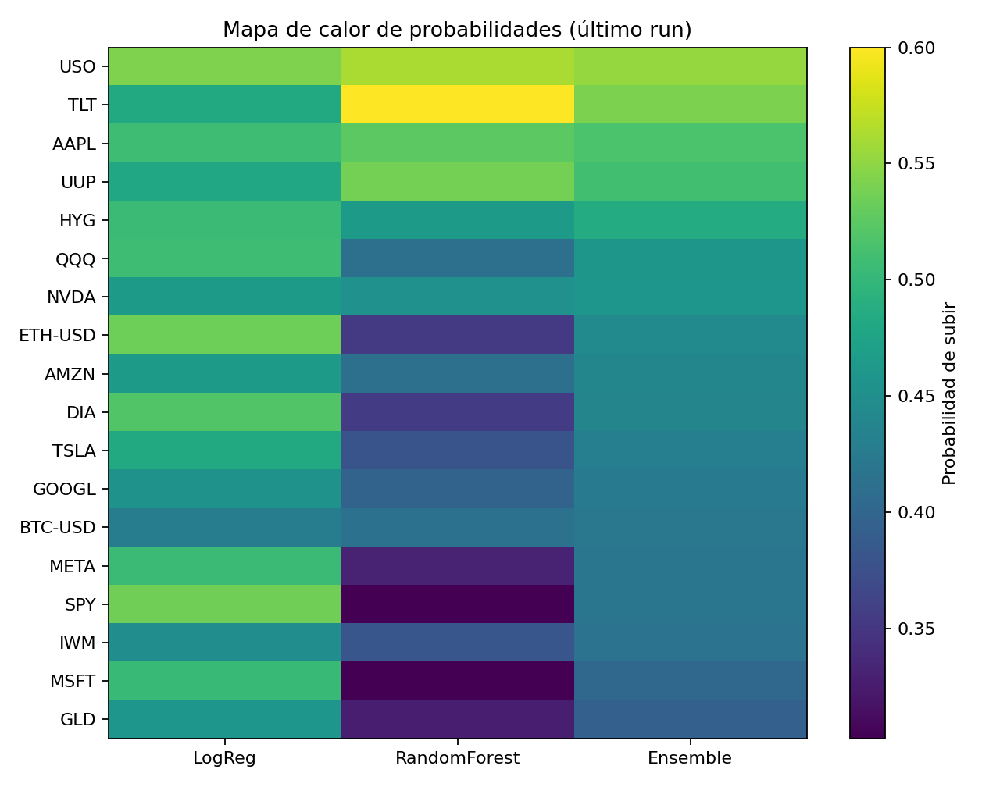
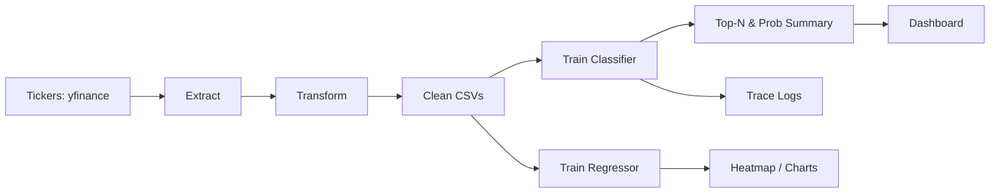
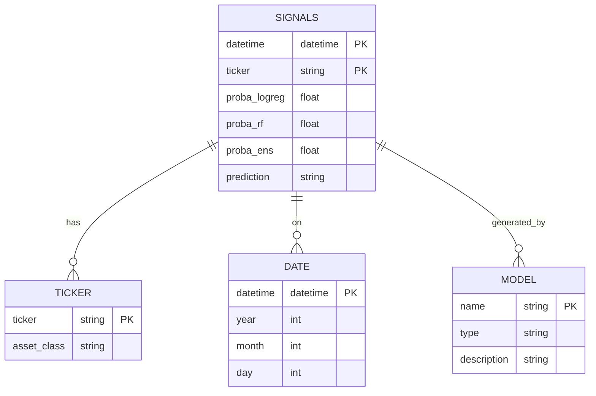

# 💹 IA-FINANCIERA · ETL → Machine Learning → KPIs & Visuals

[](https://www.python.org/)
[](https://pandas.pydata.org/)
[](https://scikit-learn.org/)
[](https://streamlit.io/)

Project that implements a full ML pipeline to extract and transform financial data, compute technical indicators, train classification models, generate UP/DOWN predictions and produce KPIs, visualizations and dashboards.

> ✅ All predictions and visuals are computed from the transformed dataset.  
> 📌 The raw data comes from Yahoo Finance via yfinance.

---

## 🧭 Table of Contents
- [Goal](#goal)
- [Preview](#preview)
- [Features](#features)
- [Architecture](#architecture)
- [Repository Structure](#repository-structure)
- [Install & Run](#install--run)
- [Backtest](#backtest)
- [Dashboard](#dashboard)
- [Credits](#credits)

---

## 🎯 Goal

- Build an ML pipeline for financial signal classification.
- Predict **probability of upward movement** (PROBA_UP) using ensemble models.
- Compute KPIs and generate charts for **Top-N bullish/bearish signals**.
- Visualize results with **heatmaps**, **tables**, and **dashboards**.
- Enable reproducibility and reusability with modular structure.

---

## 🖼️ Preview

<p align="center">
  
  
</p>

> Visuals are generated automatically from model outputs.

---

## ✨ Features

- 🔁 Full ETL: download, transform, deduplicate and enrich OHLCV time series.
- 🧠 Technical indicators: RSI, MACD, EMA, SMA, Bollinger Bands, ATR...
- 🔍 Classification: Logistic Regression + Random Forest + Ensemble
- 📈 Top-N Calls & Puts (UP/DOWN predictions)
- 📊 Heatmap & Summary CSV
- 📤 Backtest & Metrics
- 🧪 Logging + Seed control
- ⚡ Streamlit dashboard (interactive)

---

## 🏗️ Architecture

### Data Flow



---

## 🧱 Star Schema – Market Signal Model



---

## 📁 Repository Structure

```
ia-financiera/
├─ data/                 # raw & transformed market data
├─ models/               # training + prediction + backtest
├─ etl/                  # extract, transform, load
├─ reports/              # CSV summaries, backtest outputs
├─ images/               # charts (heatmap, topN, equity curve)
├─ apps/                 # Streamlit dashboard
├─ scripts/              # utility scripts (heatmap, topN)
├─ utils/                # config, logging, seed tools
├─ menu.py               # 🔁 main entrypoint (ETL + Train + Predict)
├─ config.yaml           # configuration
└─ README.md             # this file
```

---

## ⚙️ Install & Run

```bash
# 1. Clone
git clone https://github.com/ShadowBlack33/ia-financiera.git
cd ia-financiera

# 2. Create environment
python -m venv .venv
.venv\Scripts\activate  # or source .venv/bin/activate

# 3. Install dependencies
pip install -r requirements.txt

# 4. Run pipeline (ETL → Train → Predict)
python menu.py
```

---

## 📈 Backtest

```bash
python -m models.backtest
```

Generates:
- `reports/backtest_preds_summary.csv`
- `reports/backtest_traces_summary.csv`
- `reports/backtest_traces_equity.png`

---

## 📊 Dashboard

```bash
streamlit run apps/dashboard_app.py
```

Visuals:
- 🔼 Top-N Bullish
- 🔽 Top-N Bearish
- 🟡 Probability Heatmap
- 🧾 Summary Table

---

## 👤 Credits

**Carlos Andrés Orozco Caicedo**  
`IA-FINANCIERA` — Machine Learning · Finance · Python · Dashboard  
🇨🇴 Universidad & Portfolio Project — 2025

---